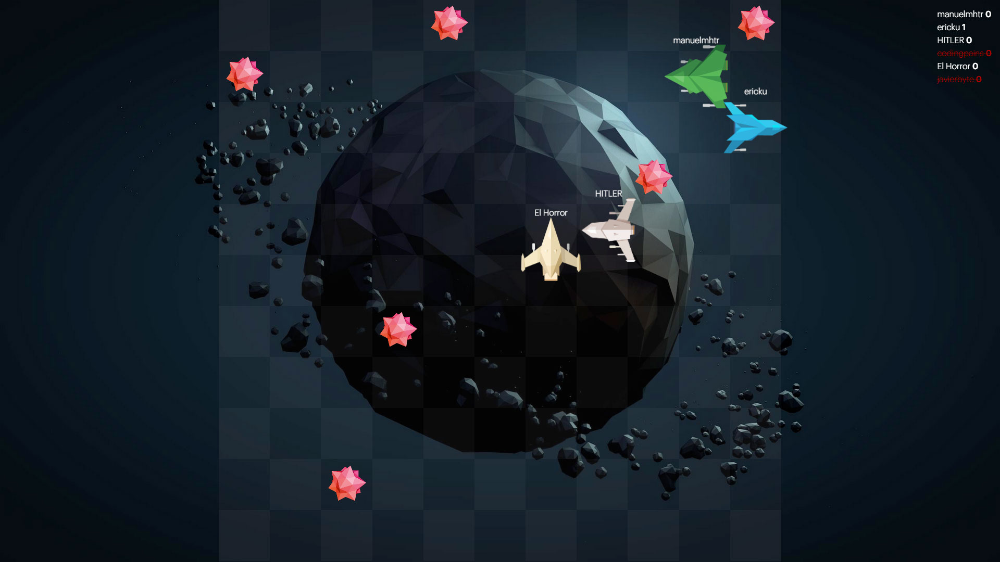
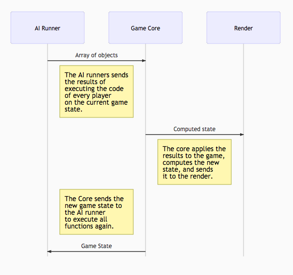
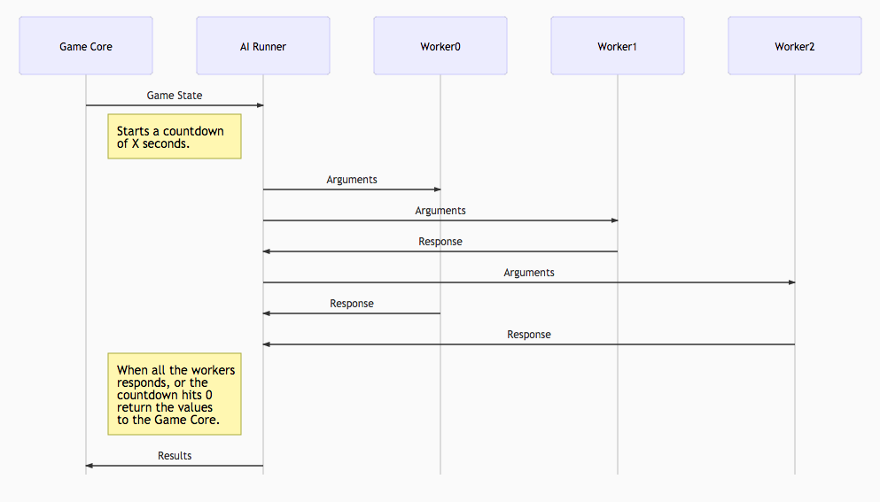

# [ClashJS](http://javierbyte.github.io/clashjs/)

[Demo Online](http://javierbyte.github.io/clashjs/)

This is an experiment. The idea is to create a battle game, where the participants code their AI, and then we make them fight! You can play by adding your own AI to the game!

# How to run the demo.

Clone the repo and then

    npm install
    npm run dev

Then go to `http://localhost:8080`.

# How to participate.
Add your player as specificed in [player definition](#player-definition) in

    /src/players/YOU.js

And then require yourself in

    /src/Players.js

And run the demo again. Have fun!

Read the [game definitions](#game-definitions) to learn how to create your player. Have fun!

# Game. Functional Spec.

## Introduction.
Games and coding are fun! So I want to make a game where we can confront AI vs AI in javascript.

The game is simple: we will put all the players in a battle arena, and then make them fight to death. Where will be ammo in the arena so they can shoot each other. The last player alive wins!

### Game Rules.
* Every player will have a position and direction on the grid. A player can not go over the grid limits, and can only face north, east, south or west.
* The game will be turn based. Every turn we will excecute the AI of every player passing as arguments:
  * The state of the player.
  * The state of all other players.
  * A environment configuration option with:
    * Grid size.
    * The position of the ammo.
* Every turn a player must execute some of the following actions:
  * Move one step in its current direction. (`move`).
  * Turn into any of the four directions. (`north`, `east`, `south`, `west`).
  * Shoot. (`shoot`).
* A player can shoot to try to destroy another player.
* A player can collect ammo in the moment it steps over it. A new ammo may appear in any moment of the game.

## Game Definitions.

### Player Definition.
Let the *player definition* (`playerDefinition`) be an object with the player info and its AI function.

    {
      info: {
        name: 'javierbyte',
        style: 2 // one of the 6 styles (0 to 5)
      },
      ai: function(playerState, enemiesStates, gameEnvironment) {
        // think...
        return 'move';
      }
    }

The AI function will receive [`playerState`](#player-state), `enemiesStates` (array of all the other players `playerState`s), and [`gameEnvironment`](#game-environment) as arguments, and must return one of the following strings:
  * `move`: To move one tile in the current direction.
  * `north`, `east`, `south` or `west`: To turn to that direction.
  * `shoot`. To shoot if the user has enough ammo.

Any other response, trying to move outside the arena size (`gameEnvironment.gridSize`) or trying to shoot without ammo, will result in a no-op.

### Player State.
Let the *player state* (`playerState`) be an object with a player information like the following:

    {
      position: `[<number>, <number>]`,
      direction: `<string>`, // One of 'north', 'east', 'south' or 'west'
      ammo: `<number>`,
      isAlive: `<bool>`
    }

### Game Environment.
Let the *game environment* (`gameEnvironment`) be a configuration object like the following:

    {
      gridSize: [<number>, <number>],
      ammoPosition: <array of [<number>, <number>] arrays>
    }

### Game State.
Let the *game state* (`gameState`) be an object with the array of all user states, and the game environment.

    {
      playerStates: <array of `playerStates`>,
      gameEnvironment: <`gameEnvironment`>
    }

# Game Technical Spec.

## Problem.
We should make an app that can take functions provided by the users, execute them, and render the game as specified in the functional spec.

## Constraints.
* Just. The game mechanics should avoid to accidentally benefit players by its random nature. The order of execution of the AIs should not benefit any player. The position of the newly create coins should try to be as just for everyone.
* Be safe. A player code should not be able to modify anything other than itself.
* Be resilient as possible. If a player crashes or stop responding, the show must go on.

## How this was made.

### Architecture.

We can divide the problem in 3 big steps.

* **AI Runner**. This will take all the user provided functions and the current game state, and execute every function.
  * This will take care of catch errors on the functions, and stop non-responding functions to hang the window.
* **Game Core**. This will take the responses that the AI Runners sends, and apply the game logic on them.
  * Kill killed players.
  * Move and turn players.
  * Collect and count coins.
  * Generate new coins if necessary.
  * Set the paralized turns to players that shooted.
  * Count if too many inactive turns had passed.
  * Stop the game when it ends.
* **Render**. This will take the game state and render it nicely.

They will interact as follows:

<!---
sequenceDiagram
AI Runner->> Game Core: Array of objects
Note left of Game Core: The AI runners sends   the results of  executing the code   of every player on the current game state.
Game Core->> Render: Game state
Note left of Render: The core applies the results to the game, computes the new state, and sends it to the render.
Note left of Game Core: The Core sends the new game state to the AI runner to execute all functions again.
Game Core->>AI Runner: Game State

http://knsv.github.io/mermaid/live_editor/
-->

# AI Runner. Spec.

## Problem.
The AI runner should execute all the functions that the players provided, with the current user state, all user states, and game enrivonment as arguments.

## Constraints.
* Prevent the user functions to modify anything except itself.
* Catch executions errors, and simply return `null` as response to the Game Core.
* Detect if any functions gets stuck in an infinite loop, and return `null` as response.

## Hypothesis.
We can run the functions as WebWorkers because:
* They can not access the dom and modify things.
* Runs in a sandbox. If they crash or stop responding we can detect it.
* Bonus: We can parallelise the excecution.

The game is designed to make irrelevant the order of execution of the AIs. So we are safe running all this asynchronous.

## Solution.
To prevent the functions to take so much time thinking (probably because an infinite loop), we will create an array of `null`s, where we will put the responses of the workers as they arrive. If `X` seconds passes (enough time to think for almost everything, except infinite loops, of couse) then we will pass the `null`ified response of that worker, and the Game Core will kill that player.

<!---
sequenceDiagram
Game Core->> AI Runner: Game State
Note left of AI Runner: Starts a countdown of X seconds.
AI Runner->> Worker0: Arguments
AI Runner->> Worker1: Arguments
Worker1->> AI Runner: Response
AI Runner->> Worker2: Arguments
Worker0->> AI Runner: Response
Worker2->> AI Runner: Response
Note left of AI Runner: When all the workers responds, or the countdown hits 0 return the values to the Game Core.
AI Runner->> Game Core: Results

http://knsv.github.io/mermaid/live_editor/
-->

# Game Core.

## Player Class.

This javascript class will recive a `playerDefinition` and return a player instance.

### Arguments:
  * [`playerDefinition`](#player-definition).
  * [`evtCallback`] A callback that will receive the arguments `evt` and `data`.

### Methods:
  * `getInfo`. Will return the player info.
  * `execute`. Will receive the following arguments:
    * [`playerState`](#player-state). The current player state.
    * `enemiesStates`. An array all the other live players `playerState`s.
    * [`gameEnvironment`](#game-environment). The game environment object.

## CashJS Class.

This class will receive all the player definitions, generate the game states, and execute the players AIs.

### Arguments:
  * `playerDefinitionArray`. An array of [`playerDefinition`](#player-definition) objects.

### Methods:
  * `getState`. Will return the current [`gameState`](#game-state).
  * `nextStep`. Will execute a step for every player (all individual plys). Will return the game state.
  * `nextPly`. Will execute the AI for the player in turn. Will return the game state.

# Render.
React.
